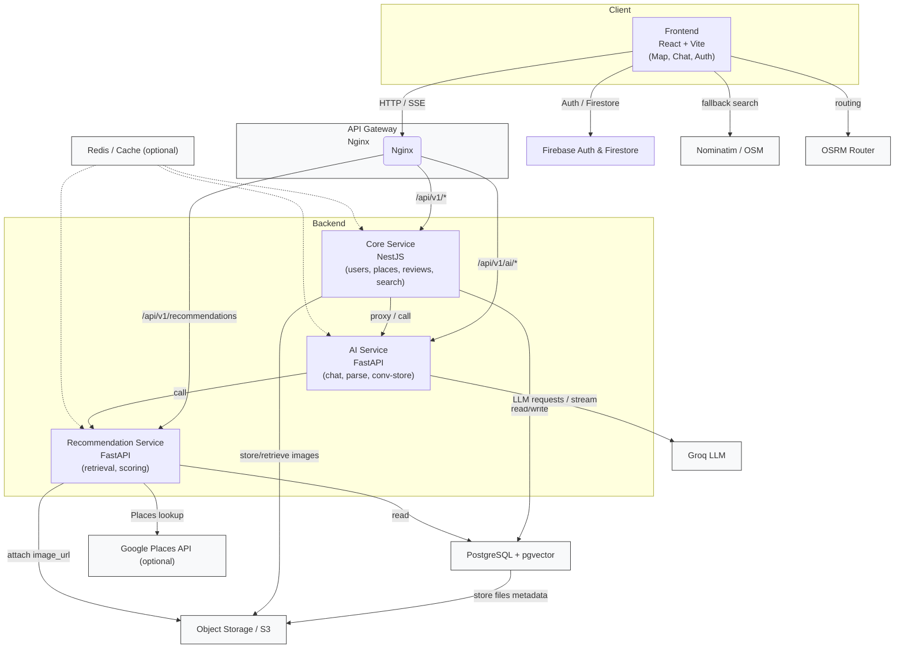

# ARCHITECTURE — Kiến trúc tổng quan

Tài liệu này chứa sơ đồ Mermaid tóm tắt các thành phần chính và luồng dữ liệu trong hệ thống.

## Sơ đồ kiến trúc (Mermaid)

## Chú giải ngắn

- Frontend: SPA (React/Vite) chịu trách nhiệm UI, map, chat widget và tương tác trực tiếp với Firebase cho auth/trip data.
- Gateway: Nginx làm reverse-proxy, phân tuyến tới các service backend.
- Core Service: NestJS cung cấp API cho users, places, reviews, search; lưu trữ chính trên Postgres (Prisma).
- AI Service: FastAPI xử lý chat (one-shot + SSE), parse text → filters, giữ conversation ngắn hạn (in-memory hoặc Redis).
- Recommendation Service: FastAPI thực hiện retrieval + scoring (Google Places hoặc DB fallback) rồi trả về results có `score` và `image_url`.
- Postgres: chứa bảng places, reviews, chunks (embedding), conversations, messages; pgvector cho embedding.
- Object Storage: lưu ảnh, file upload; services trả về `image_url`.
- External: Groq (LLM), Google Places (optional), Nominatim/OSM, OSRM.

---

Nếu muốn mình chỉnh layout sơ đồ (ngang/dọc), thêm annotations (module internals), hoặc xuất thành PNG/SVG, báo mình chọn dạng bạn muốn.