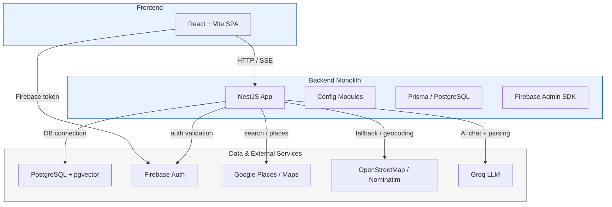

# ARCHITECTURE — Current Mono Architecture

This document describes the current `mono` architecture in the repository: a single modular NestJS backend with a React frontend and PostgreSQL persistence.

## System overview

- `mono/frontend`: React + Vite SPA. Provides UI, authentication, map search, chat, and file contributions.
- `mono/backend`: NestJS monolith on port `3001` with modular APIs under `/api/v1`.
- `mono/backend/prisma`: Prisma ORM schema and migrations targeting PostgreSQL with `pgvector`.
- `mono/docker-compose.yml`: local infrastructure with `postgres` and application containers.

## Architecture diagram

## Backend structure

The backend is a single NestJS application composed of the following feature modules:

- `UsersModule` — user profile creation and retrieval, Firebase UID mapping, auth-related operations.
- `PlacesModule` — place persistence, source metadata, geolocation, categories.
- `ReviewsModule` — user reviews for places.
- `SearchModule` — search orchestration across providers and local place store.
- `HealthModule` — health checks.
- `ChatModule` — streaming and non-streaming AI chat endpoints.
- `AiModule` — NLP parsing and recommendation orchestration.
- `RecommendationsModule` — ranked recommendation scoring and results.
- `RagModule` — retrieval-augmented generation support, chunking, embeddings, and metadata.
- `PresenceModule` — user presence tracking by place.
- `ContributionsModule` — file upload/contribution management.

The root module is `mono/backend/src/app.module.ts`, which imports all modules plus global configuration and `PrismaModule`.

## API surface

The NestJS app exposes a single API prefix:

- `/api/v1/*`
- Swagger docs at `/api/docs`

Important routes include:

- `/api/v1/users`
- `/api/v1/places`
- `/api/v1/reviews`
- `/api/v1/search`
- `/api/v1/ai/chat`
- `/api/v1/ai/chat/stream`
- `/api/v1/ai/parse`
- `/api/v1/ai/rag/chunks`
- `/api/v1/recommendations`
- `/api/v1/presence/:placeId`
- `/api/v1/contributions/files`

## Deployment and runtime

- `mono/backend/main.ts` configures global validation, CORS, and Swagger.
- The application reads configuration from environment variables via `ConfigModule.forRoot(...)`.
- `mono/backend/Dockerfile` builds the NestJS backend and generates Prisma client code.
- `mono/docker-compose.yml` defines services for `frontend`, `backend`, and `postgres`.

## Data and persistence

The backend persists data in PostgreSQL using Prisma. Key database models include:

- `User` / `app_users`
- `Place` / `places`
- `Review` / `reviews`
- `File` / `files`
- `Chunk` / `chunks` (RAG storage, embedding vectors)
- `Conversation` / `conversations`
- `Message` / `messages`

The database uses the `vector` extension for embedding storage and semantic search.

## External integrations

- Firebase Auth: authenticates users and issues tokens consumed by the frontend.
- Google Places / Maps: optional lookup and search provider.
- OpenStreetMap / Nominatim: fallback search and geocoding.
- Groq LLM: AI chat and parsing.

## Key architectural characteristics

- Single monolithic backend: all API modules are loaded in one NestJS process.
- Modular design: each domain area is implemented as an independent Nest module.
- Persistent state: PostgreSQL handles application storage and RAG embeddings.
- External auth: Firebase provides identity, while internal user state is stored in Postgres.
- Vector search support: `pgvector` enables semantic retrieval of text chunks.

## Migration history

This repo consolidates a previous microservice architecture into the current mono app.

- `core-service` → NestJS modules for users, places, reviews, and search.
- `ai-service` and `recommendation-service` → ported into NestJS modules for chat, AI, and recommendations.
- `gateway` / Nginx is no longer required in the mono architecture.

## Notes for other agents

- `mono/backend/src/app.module.ts` is the current entry point.
- `mono/backend/src/main.ts` defines routing and runtime behavior.
- `mono/backend/prisma/schema.prisma` is the canonical schema source.
- `mono/docker-compose.yml` describes local infrastructure and container relationships.
- The frontend communicates directly with the backend via HTTP and uses Firebase for auth.
- The backend does not rely on a separate API gateway in this architecture.
