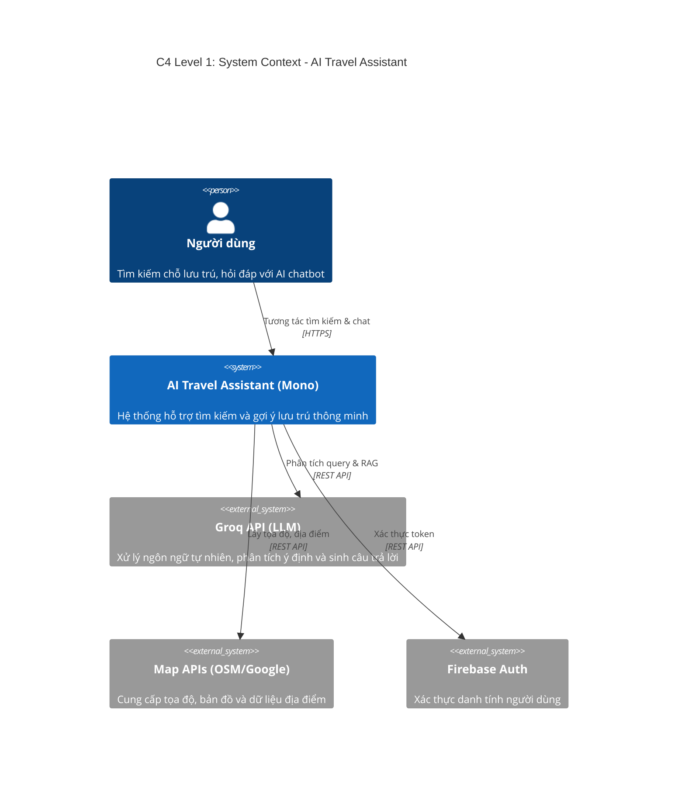
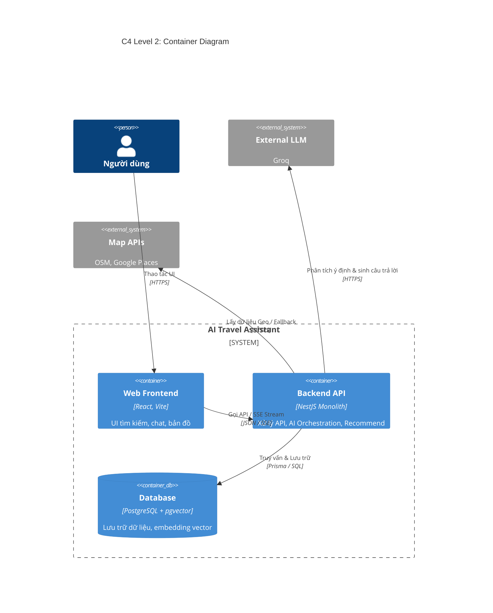
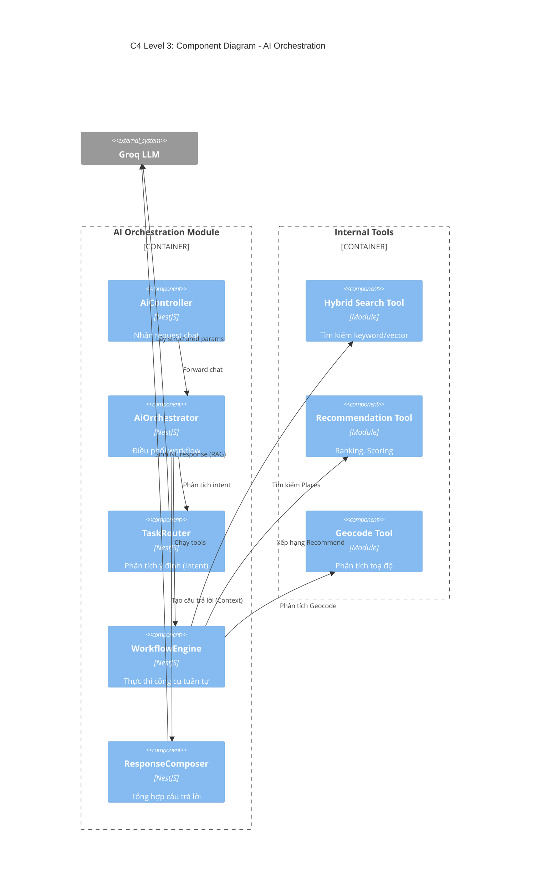

# Cấu trúc Kiến trúc (Architecture) - Dự án Chatbot Travel System (Mono)

Tài liệu này đặc tả toàn bộ kiến trúc của hệ thống, bao gồm từ cái nhìn tổng quan, mô hình C4 (từ Mức 1 đến Mức 3), đến luồng dữ liệu (Data-flow) cho từng Use Case cụ thể. Hệ thống sử dụng kiến trúc monolith phân lớp (Modular NestJS) kết hợp cùng React frontend và PostgreSQL (pgvector).

---

## 1. Tổng quan hệ thống (System Overview)

- **`mono/frontend`**: React + Vite SPA. Cung cấp giao diện người dùng, xác thực (Firebase), tìm kiếm bản đồ, khung chat AI và nạp dữ liệu (contributions).
- **`mono/backend`**: NestJS monolith chạy trên cổng `3001` với các API định tuyến tại `/api/v1`.
- **`mono/backend/prisma`**: Sử dụng Prisma ORM và schema cho PostgreSQL có tích hợp extension `pgvector` phục vụ RAG.
- **`mono/docker-compose.yml`**: Thiết lập hạ tầng local, chứa các container cho `postgres`, `frontend` và `backend`.

---

## 2. Mô hình C4 (C4 Model)

Mô hình C4 mô tả kiến trúc từ khái quát đến chi tiết.

### 2.1. Mức 1: Bối cảnh hệ thống (System Context)
Mô tả cách người dùng tương tác với hệ thống và các dịch vụ bên ngoài.

```mermaid
C4Context
    title C4 Level 1: System Context - AI Travel Assistant
    Person(user, "Người dùng", "Tìm kiếm chỗ lưu trú, hỏi đáp với AI chatbot")
    System(coreSystem, "AI Travel Assistant (Mono)", "Hệ thống hỗ trợ tìm kiếm và gợi ý lưu trú thông minh")
    System_Ext(groq, "Groq API (LLM)", "Xử lý ngôn ngữ tự nhiên, phân tích ý định và sinh câu trả lời")
    System_Ext(maps, "Map APIs (OSM/Google)", "Cung cấp tọa độ, bản đồ và dữ liệu địa điểm")
    System_Ext(firebase, "Firebase Auth", "Xác thực danh tính người dùng")

    Rel(user, coreSystem, "Tương tác tìm kiếm & chat", "HTTPS")
    Rel(coreSystem, groq, "Phân tích query & RAG", "REST API")
    Rel(coreSystem, maps, "Lấy tọa độ, địa điểm", "REST API")
    Rel(coreSystem, firebase, "Xác thực token", "REST API")
```

### 2.2. Mức 2: Khối chứa (Container Diagram)
Bên trong hệ thống `AI Travel Assistant` gồm có Frontend, Backend và Database.

```mermaid
C4Container
    title C4 Level 2: Container Diagram
    Person(user, "Người dùng")
    System_Boundary(system, "AI Travel Assistant") {
        Container(frontend, "Web Frontend", "React, Vite", "UI tìm kiếm, chat, bản đồ")
        Container(backend, "Backend API", "NestJS Monolith", "Xử lý API, AI Orchestration, Recommend")
        ContainerDb(db, "Database", "PostgreSQL + pgvector", "Lưu trữ dữ liệu, embedding vector")
    }
    System_Ext(llm, "External LLM", "Groq")
    System_Ext(maps, "Map APIs", "OSM, Google Places")

    Rel(user, frontend, "Thao tác UI", "HTTPS")
    Rel(frontend, backend, "Gọi API / SSE Stream", "JSON / SSE")
    Rel(backend, llm, "Phân tích ý định & sinh câu trả lời", "HTTPS")
    Rel(backend, maps, "Lấy dữ liệu Geo / Fallback", "HTTPS")
    Rel(backend, db, "Truy vấn & Lưu trữ", "Prisma / SQL")
```

### 2.3. Mức 3: Thành phần (Component Diagram - AI Orchestration)
Đặc tả chi tiết bên trong Backend, đặc biệt là module AI (Agentic Workflow/Orchestration).

```mermaid
C4Component
    title C4 Level 3: Component Diagram - AI Orchestration
    Container_Boundary(aiModule, "AI Orchestration Module") {
        Component(aiController, "AiController", "NestJS", "Nhận request chat")
        Component(orchestrator, "AiOrchestrator", "NestJS", "Điều phối workflow")
        Component(taskRouter, "TaskRouter", "NestJS", "Phân tích ý định (Intent)")
        Component(workflowEngine, "WorkflowEngine", "NestJS", "Thực thi công cụ tuần tự")
        Component(composer, "ResponseComposer", "NestJS", "Tổng hợp câu trả lời")
    }
    Container_Boundary(tools, "Internal Tools") {
        Component(toolSearch, "Hybrid Search Tool", "Module", "Tìm kiếm keyword/vector")
        Component(toolRecommend, "Recommendation Tool", "Module", "Ranking, Scoring")
        Component(toolGeocode, "Geocode Tool", "Module", "Phân tích toạ độ")
    }
    System_Ext(groq, "Groq LLM", "")

    Rel(aiController, orchestrator, "Forward chat")
    Rel(orchestrator, taskRouter, "Phân tích intent")
    Rel(taskRouter, groq, "Lấy structured params")
    Rel(orchestrator, workflowEngine, "Chạy tools")
    Rel(workflowEngine, toolSearch, "Tìm kiếm Places")
    Rel(workflowEngine, toolRecommend, "Xếp hạng Recommend")
    Rel(workflowEngine, toolGeocode, "Phân tích Geocode")
    Rel(orchestrator, composer, "Tạo câu trả lời (Context)")
    Rel(composer, groq, "Sinh NL response (RAG)")
```

---

## 3. Phân rã chức năng (Module Decomposition)

Backend là một ứng dụng NestJS nguyên khối (Monolith) nhưng được chia thành các module độc lập theo miền (Domain-driven), giúp dễ bảo trì và dễ scale thành microservices khi cần:

- **Core Modules**:
  - `UsersModule`: Quản lý user profile, map Firebase UID, auth.
  - `PlacesModule`: Quản lý thông tin địa điểm (metadata, tọa độ).
  - `ReviewsModule`: Lưu trữ và xử lý nhận xét, review.
  - `SearchModule`: Orchestration việc tìm kiếm giữa local DB và providers bên ngoài.
- **AI & Recommendation Modules**:
  - `RecommendationsModule`: Chấm điểm (scoring) và xếp hạng (ranking) điểm đến theo tiêu chí (giá, khoảng cách, review).
  - `ChatModule`: API quản lý luồng chat (stream/non-stream).
  - `AiModule`: Chịu trách nhiệm phân tích ý định (NLP Parsing) và Agentic Orchestration.
  - `RagModule`: Quản lý Retrieval-Augmented Generation, chunking file, embedding vectors.
- **Support & On-site Modules**:
  - `PresenceModule`: Theo dõi trạng thái người dùng khi đến thực tế tại một địa điểm (on-site).
  - `ContributionsModule`: Xử lý upload tài liệu, menu, bảng giá, hình ảnh từ người dùng thực tế.
  - `HealthModule`: Kiểm tra trạng thái hệ thống.

---

## 4. Luồng dữ liệu và Use Cases (Data-flow)

### 4.1. Basic Search & Advanced Search
- **Yêu cầu**: Tìm kiếm khách sạn, resort dựa vào text hoặc bộ lọc (location, budget).
- **Luồng tìm kiếm**: Request tới `SearchController` $\rightarrow$ Chuẩn hoá params $\rightarrow$ **Concurrent Search** (Truy vấn Local DB + Gọi External Providers) $\rightarrow$ Deduplicate & Merge $\rightarrow$ (Tùy chọn) Chuyển qua `RecommendationsService` để ranking lại $\rightarrow$ Trả kết quả JSON cho Client.

### 4.2. Trợ lý AI và Xử lý hội thoại tự nhiên (AI Chat & NLP)
- **Yêu cầu**: Tìm kiếm, hỏi đáp chi tiết về dịch vụ thông qua ngôn ngữ tự nhiên.
- **Quy trình Orchestration**:
  1. Người dùng gửi câu hỏi qua `/api/v1/ai/chat`.
  2. **Router**: LLM phân tích Intent (là tìm kiếm hay hỏi đáp RAG).
  3. **Workflow Engine**: Nếu là hỏi đáp, gọi `RagModule` truy vấn `pgvector` lấy Top-K `chunks` gần nhất.
  4. **Composer**: Lắp Context (Chunks đã retrieve) + User Query, gửi Prompt cuối cùng lên LLM.
  5. Trả kết quả dưới dạng Server-Sent Events (SSE) kèm theo trích dẫn (`sources`).

### 4.3. On-site QA & Tương tác tại điểm
- **Yêu cầu**: Hỗ trợ trao đổi thông tin thời gian thực giữa người dùng trên hệ thống và người dùng đang có mặt tại địa điểm đó (on-site).
- **Quy trình**:
  1. Khi người dùng đến địa điểm, gửi request tới `/api/v1/presence/:placeId/join`.
  2. Có thể Upload tài liệu/hình ảnh qua `/api/v1/contributions/files`.
  3. Một Background Worker sẽ tiến hành nhận diện file $\rightarrow$ Cắt nhỏ (Chunking) $\rightarrow$ Embedding $\rightarrow$ Ghi vào `chunks` table. Dữ liệu này ngay lập tức làm giàu cho RAG DB.

---

## 5. Dữ liệu và Lưu trữ (Data & Persistence)

Hệ thống sử dụng **PostgreSQL** là nguồn dữ liệu duy nhất (Single Source of Truth), truy cập thông qua **Prisma ORM**.
Các Entity / Bảng chính:
- Dữ liệu cấu trúc: `users`, `places`, `reviews`, `files`
- LLM / Chat: `conversations`, `messages`
- RAG Storage: Bảng `chunks` với trường `embedding` sử dụng extension `vector` để truy vấn Nearest Neighbor siêu tốc (Semantic Search).

---

## 6. Môi trường và Ràng buộc (Deployment & Constraints)

- **Kiến trúc mạng**: Thiết kế tinh gọn, Frontend gọi trực tiếp Backend API. Không sử dụng Nginx Proxy/Gateway trong môi trường dev nhằm giảm thiểu độ phức tạp.
- **Phần cứng**: Phù hợp cho môi trường máy trạm tiêu chuẩn (16GB RAM, CPU 3.8GHz). Không yêu cầu GPU cục bộ (VGA) nhờ offload toàn bộ quá trình xử lý LLM nặng nề sang API của các provider bên ngoài (Groq, Anthropic, OpenAI).
- **Triển khai**: Toàn bộ hệ thống được đóng gói sẵn trong `docker-compose.yml`. Chỉ với `docker compose up`, hệ thống sẽ khởi tạo đồng thời Database (kèm cài sẵn pgvector), Backend NestJS và Frontend React.

---
_Lưu ý: Mọi cấu trúc module hay routing mới cần được tham chiếu và cập nhật vào tài liệu này để giữ tính thống nhất của toàn hệ thống._
