# **Nhóm 12** 

# **Cập nhật so với buổi trình bày**

### Thay đổi về kiến trúc dự án

Trước đây, hệ thống được thiết kế theo hướng **microservices**, với mỗi chức năng lớn như Core, AI, Recommendation, Frontend,... được triển khai thành các service riêng biệt, giao tiếp qua API Gateway. Cách tiếp cận này phù hợp cho các hệ thống lớn, dễ mở rộng nhưng phức tạp khi phát triển MVP do tốn nhiều công sức triển khai, quản lý hạ tầng và đồng bộ dữ liệu giữa các service.

Sau khi đánh giá lại mục tiêu và phạm vi MVP, nhóm đã chuyển sang kiến trúc **monolith** module hóa. Toàn bộ backend được xây dựng thành một ứng dụng duy nhất, nhưng vẫn phân chia rõ ràng thành các module chức năng (Core, Recommendation, NLP,...). Mỗi module đảm nhận một nhóm nghiệp vụ riêng, giúp codebase dễ bảo trì, phát triển nhanh và thuận tiện kiểm thử. Khi cần mở rộng quy mô, các module này có thể tách dần thành service độc lập mà không ảnh hưởng đến logic tổng thể.

### Bổ sung và cải thiện các tính năng

**Cải thiện bộ lọc**
Bổ sung thêm các tiêu chí khác như: 
- Số lượng phòng 
- Mật độ khách hàng đang có mặt
- Cho phép người dùng nhập ghi chú hoặc yêu cầu đặc biệt (ví dụ: "gần biển", "cách trung tâm thành phố 5km", "phòng có view sông hồ", "có bãi đỗ xe", "phù hợp cho trẻ nhỏ", v.v.). Hệ thống sẽ sử dụng AI để phân tích và tự động chuyển các ghi chú này thành tiêu chí lọc cụ thể hoặc phân tích trên tập kết quả đầu ra.
- Hỗ trợ lọc theo các tiện ích bổ sung như: hồ bơi, phòng gym, bữa sáng miễn phí, dịch vụ đưa đón sân bay,...

**Hỗ trợ so sánh**
Người dùng có thể lựa chọn các địa điểm đang phân vân và đưa vào một danh sách. AI sẽ tự động phân tích điểm mạnh, điểm yếu của từng địa điểm dựa trên dữ liệu thực tế và các tiêu chí người dùng quan tâm (ví dụ: "Địa điểm A gần biển nhưng giá cao hơn", "Địa điểm B có nhiều tiện ích nhưng xa trung tâm", ...). Hỗ trợ xuất bảng so sánh ra file hoặc chia sẻ với bạn bè để tham khảo ý kiến.

### Phần phân rã bài toán - cập nhật lại WBS

Nhóm em đã tiến hành cập nhật lại Work Breakdown Structure theo góc nhìn của nhà phát triển, qua đó phân rã các thành phần chính thành các tác vụ nhỏ hơn, đưa ra cái nhìn tổng thể hơn về hệ thống.

**Xác định mục tiêu dự án**

Mục tiêu của hệ thống là tạo ra một chương trình hỗ trợ người dùng lựa chọn địa điểm lưu trú một cách thông minh. Các tính năng chính bao gồm:
- Tìm kiếm theo bộ lọc nâng cao
- Xử lý yêu cầu (ngôn ngữ tự nhiên) của người dùng, parse về dạng chuẩn hoá và tự động thực thi các workflow, cụ thể:
  - Workflow tìm kiếm
  - Workflow thu thập thông tin tại địa điểm nhất định
- Hỗ trợ tương tác người dùng on-site
- Hỗ trợ thu thập thông tin từ nền tảng tương tác giữa các người dùng
- Hỗ trợ so sánh giữa hai (hoặc nhiều hơn) địa điểm

**Phân rã thành các components**
Từ mục tiêu lớn này, phân rã theo các System cần có:
  - Môi trường phát triển và hạ tầng
  - Hệ thống database
  - Hệ thống frontend
  - Hệ thống backend

Từ các system, chia nhỏ ra thành các module với các subsystem:
- **Môi trường phát triển và hạ tầng:**
  - Dùng docker compose triển khai kiểm thử tại local
  - Sử dụng git/github cho task version control

- **Database:**
  - Thiết kế lược đồ quan hệ
  - Tích hợp Object Storage lưu trữ các tệp vật lý

- **Frontend:** Cài đặt các components cốt lõi:
  - **Trang đăng nhập:** 
    - Đăng nhập bằng email
    - Đăng nhập bằng google
  - **Trang chính:**
    - Navbar
    - Bản đồ: sử dụng external API
    - Box chat AI
    - Giao diện tìm kiếm theo filter: các tiêu chí như: giá cả, thời gian ở, đánh giá tổng thể, vị trí, bán kính tìm kiếm, có textbox ghi chú để người dùng có thể custom thêm đặc điểm
  
  - **Sidebar kết quả tìm kiếm:**
    - Giao diện danh sách các địa điểm: hiển thị các thông tin cơ bản như tên, địa chỉ, đánh giá, nút chỉ đường

  - **Trang thông tin chi tiết cho từng địa điểm:**
    - Giao diện nền tảng QA: reddit-like, người dùng có thể 
    - Giao diện chatbot tích hợp với từng địa điểm

  - **Trang so sánh các địa điểm lưu trú:**
    - Danh sách các địa điểm được xếp hạng là phù hợp với người dùng
    - Nêu lên những điểm nổi bật và bất lợi của từng địa điểm một cách trực quan

  - **Profile người dùng:** hiển thị các đánh giá của người dùng, trạng thái hoạt động, nút chat, ...

- **Backend:** chia thành các module
  - **Core Module:** trung tâm quản lý dữ liệu và logic nghiệp vụ cơ bản, đóng vai trò xương sống cho toàn bộ hệ thống backend
    - Quản lý đăng nhập/ đăng ký/ người dùng
    - CRUD API với reviews/ places/ users 

  - **Reccomendation Module:**
    - Truy vấn dữ liệu
    - Xử lý các candidates:
      - Đánh giá độ phù hợp của các candidate dựa trên filter
      - LLM phân tích ghi chú custom của người dùng
    - Xếp hạng: đánh giá theo điểm
  
  - **NLP Module:**
    - Gọi tới API bên ngoài
    - Parser: phân tích ngôn ngữ tự nhiên thành dạng chuẩn hoá
    - Communicator: trả lời người dùng với câu hỏi cơ bản
    - RAG: Truy xuất thông tin để trả lời
      
**WBS sau khi chỉnh sửa**

```mermaid
graph TD
    A[Hệ thống hỗ trợ lựa chọn địa điểm lưu trú thông minh]

    %% Level 1
    A --> C[Môi trường & Hạ tầng]
    A --> D[Database]
    A --> E[Frontend]
    A --> F[Backend]



    %% Infra
    C --> C1[Local Testing: Docker Compose]
    C --> C2[Version Control: Git/Github]

    %% Database
    D --> D1[Thiết kế Schema]
    D --> D2[Tích hợp Object Storage]
    D2 --> D21[Images]
    D2 --> D22[Videos]
    D2 --> D23[Documents]

    %% Frontend
    E --> E1[Login Page]
    E1 --> E11[Email login]
    E1 --> E12[Google login]

    E --> E2[Main Page]
    E2 --> E21[Navbar]
    E2 --> E22[Map API]
    E2 --> E23[AI Chatbox]
    E2 --> E24[Search Filters]
    E24 --> E241[Price]
    E24 --> E242[Duration]
    E24 --> E243[Rating]
    E24 --> E244[Location]
    E24 --> E245[Radius]
    E24 --> E246[Custom notes]

    E --> E3[Search Sidebar]
    E3 --> E31[Place list]
    E3 --> E32[Basic info]
    E32 --> E321[Name]
    E32 --> E322[Address]
    E32 --> E323[Rating]
    E32 --> E324[Direction]

    E --> E4[Place Detail]
    E4 --> E41[Q&A platform]
    E4 --> E42[Chatbot]

    E --> E5[User Profile]
    E5 --> E51[Recent reviews]
    E5 --> E52[Activity status]
    E5 --> E53[Giao diện chat user-user]

    E --> E6[Comparating Page]
    E6 --> E61[List of suitable places]
    E6 --> E62[Detail comparation]

    %% Backend
    F --> F1[Core Module]
    F1 --> F11[Authentication]
    F1 --> F13[CRUD APIs]
    F13 --> F131[Reviews]
    F13 --> F132[Places]
    F13 --> F133[Users]

    F --> F2[Recommendation Module]
    F2 --> F21[Data Query]
    F2 --> F22[Candidate Processing]
    F22 --> F221[Filter matching]
    F22 --> F222[LLM note analysis]
    F2 --> F23[Ranking]

    F --> F3[NLP Module]
    F3 --> F31[External API]
    F3 --> F32[Parser: ngôn ngữ tự nhiên -> chuẩn hoá]
    F3 --> F33[Communicator: giao tiếp cơ bản với người dùng]
    F3 --> F34[RAG: truy xuất dữ liệu để trả lời yêu cầu]
```

  
# **Những điểm khác biệt so với nhóm khác**

### **Cho phép người dùng tương tác với nhau**
Hệ thống không chỉ hỗ trợ tìm kiếm địa điểm mà còn tạo môi trường để người dùng trao đổi, học hỏi lẫn nhau. Mỗi địa điểm đều có nền tảng hỏi đáp (Q&A) nơi người dùng có thể đặt câu hỏi, trả lời, bình luận, chia sẻ kinh nghiệm thực tế về địa điểm đó. Ngoài ra, hệ thống còn tích hợp tính năng chat trực tiếp giữa các người dùng, giúp họ dễ dàng kết nối, trao đổi thông tin, thảo luận về các địa điểm quan tâm hoặc hỗ trợ nhau trong quá trình lựa chọn.

### **Tích hợp AI phân tích ngôn ngữ tự nhiên và tự động hoá workflow**
- Người dùng chỉ cần nhập yêu cầu bằng tiếng Việt tự nhiên, AI sẽ tự động phân tích, chuẩn hoá và chuyển thành tiêu chí tìm kiếm hoặc thực hiện các tác vụ phức tạp như so sánh, gợi ý, tổng hợp đánh giá, thu thập thông tin mới nhất.
- Không chỉ dừng ở tìm kiếm, AI còn tự động hóa các quy trình xử lý, giúp tiết kiệm thời gian và nâng cao trải nghiệm.
