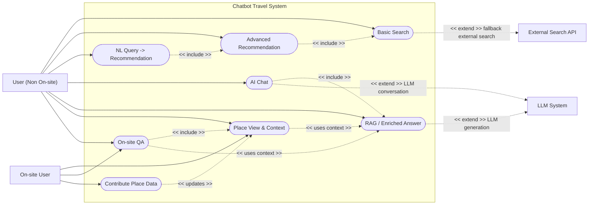
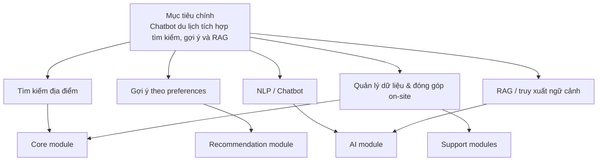
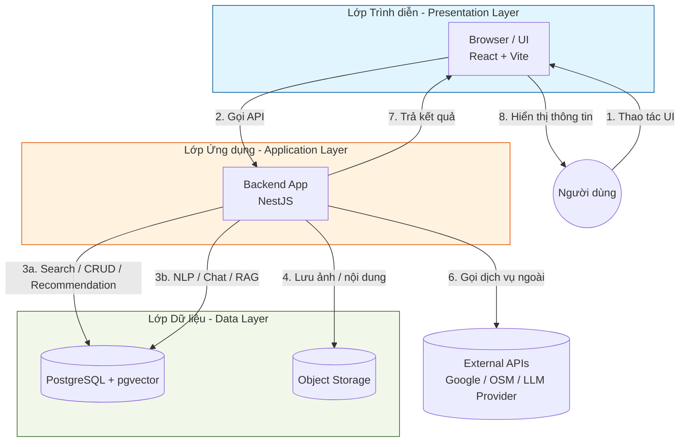
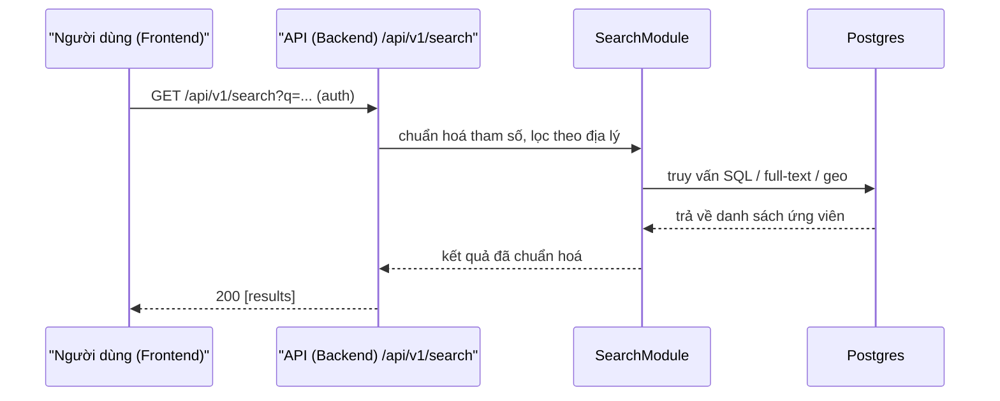
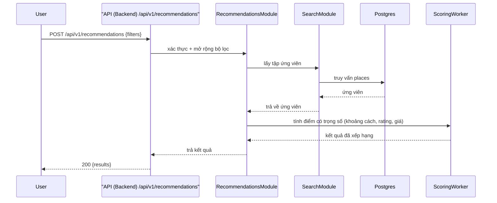
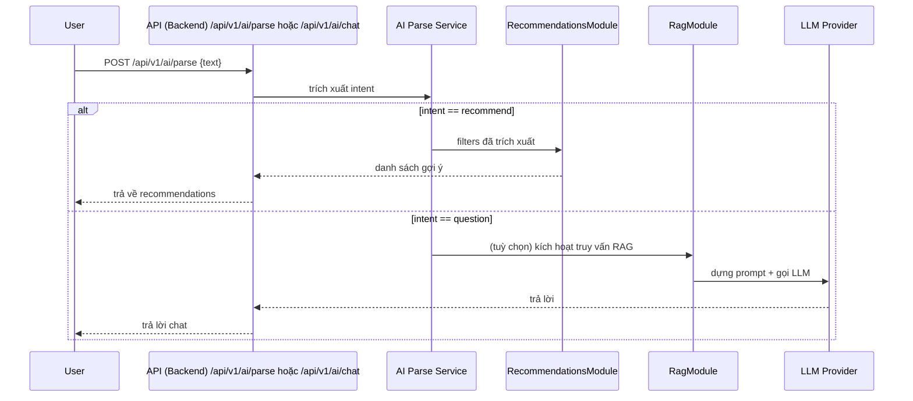
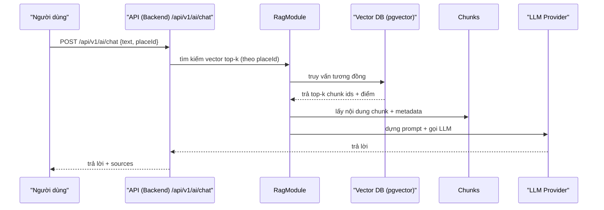
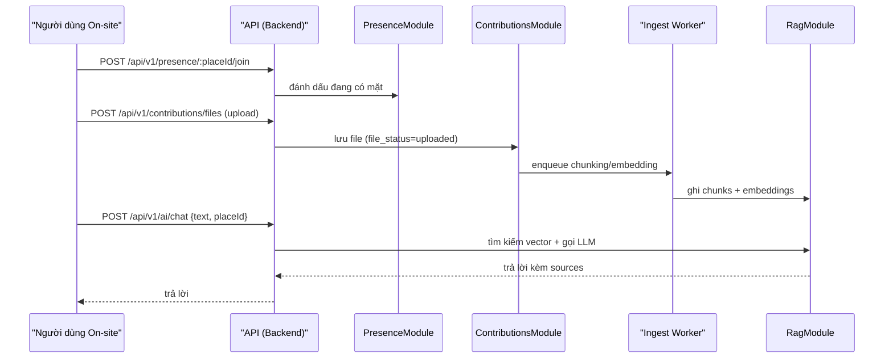

# **Báo Cáo Lần Hai** 

# **Giới thiệu**

## **Đặt vấn đề**

Hiện nay, người dùng gặp nhiều khó khăn trong việc tìm kiếm chỗ lưu trú phù hợp do thông tin bị phân tán trên nhiều nền tảng và thiếu sự đồng nhất. Các yếu tố quan trọng như giá cả, vị trí, tiện nghi và chất lượng dịch vụ thường tồn tại dưới dạng dữ liệu rời rạc, mang tính chủ quan và khó so sánh.

Điều này khiến người dùng phải tốn nhiều thời gian để tổng hợp thông tin, nhưng vẫn khó đưa ra quyết định chính xác. Đồng thời, các hệ thống hiện tại chưa thực sự hiểu nhu cầu cá nhân, chủ yếu dựa trên bộ lọc thủ công và thiếu khả năng xử lý dữ liệu đa nguồn một cách thông minh.

Do đó, nhóm chúng em đề xuất xây dựng một hệ thống gợi ý lưu trú thông minh có khả năng hiểu ngôn ngữ tự nhiên, chuẩn hoá dữ liệu từ nhiều nguồn và cung cấp các đề xuất nhanh chóng, chính xác, mang tính cá nhân hoá cao.

## **Mô tả mục tiêu chương trình**

Mục tiêu của chương trình là xây dựng một hệ thống hỗ trợ tìm kiếm và đánh giá chỗ lưu trú thông minh, giúp người dùng đưa ra quyết định nhanh chóng, chính xác và đáng tin cậy dựa trên thông tin thực tế và tương tác trực tiếp.

Để đạt được mục tiêu này, hệ thống tập trung vào các chức năng chính: cho phép người dùng tìm kiếm và xem thông tin lưu trú từ nhiều nguồn; tích hợp chatbot AI theo từng địa điểm, có khả năng hiểu ngôn ngữ tự nhiên và trả lời câu hỏi dựa trên dữ liệu như đánh giá, nội dung lưu trữ và thông tin do người dùng đóng góp; đồng thời hỗ trợ người dùng tương tác trực tiếp với những người đang có mặt tại địa điểm (on-site) thông qua cơ chế hỏi đáp và trao đổi theo thời gian thực. Bên cạnh đó, hệ thống cũng cung cấp các gợi ý lưu trú ở mức cơ bản nhằm hỗ trợ quá trình lựa chọn.

# **Problem Analysis**

## **Input**

Người dùng có thể cung cấp yêu cầu tìm kiếm dưới nhiều dạng khác nhau, bao gồm:

**Ngôn ngữ tự nhiên**: mô tả nhu cầu bằng câu tự do (ví dụ: “khách sạn gần trung tâm, giá rẻ, yên tĩnh, có hồ bơi”).
**Dữ liệu có cấu trúc**: payload JSON từ frontend, chứa các trường đã được chuẩn hoá để hệ thống xử lý tự động.
**Ngữ cảnh tương tác**: câu hỏi gửi tới chatbot hoặc nội dung trao đổi với người dùng khác tại một địa điểm cụ thể.
**Sử dụng bộ lọc được chuẩn hoá với các preferences thường thấy**:
- Ngân sách / chi phí
- Vị trí, khoảng cách hoặc bán kính tìm kiếm
- Loại hình lưu trú (khách sạn, homestay, resort, …)
- Tiện nghi (wifi, hồ bơi, bãi đỗ xe, …)
- Thời gian lưu trú / số lượng người

## **Output**

Hệ thống được kỳ vọng trả về danh sách các địa điểm lưu trú được đề xuất, được sắp xếp theo mức độ phù hợp với nhu cầu của người dùng. Mỗi kết quả thường bao gồm:

**Thông tin cơ bản**: tên, địa chỉ, toạ độ (lat/lng)
Nội dung mô tả: ảnh minh hoạ, mô tả ngắn
**Đánh giá**: điểm rating và điểm xếp hạng tổng hợp (score)
**Thông tin bổ sung**: giá cả, mức độ phù hợp với từng preference của người dùng

**Ngoài ra, hệ thống còn cung cấp các khả năng hỗ trợ bổ sung:**

- Cho phép người dùng đặt câu hỏi trực tiếp về từng địa điểm thông qua chatbot AI, với câu trả lời được sinh dựa trên dữ liệu liên quan (reviews, nội dung đã lưu trữ, v.v.)
- Hỗ trợ hiển thị thông tin từ tương tác của người dùng khác (đặc biệt là người đang có mặt tại địa điểm) nhằm tăng độ tin cậy và tính thực tế

_Kết quả được sắp xếp theo điểm và có thể kèm theo metadata như nguồn dữ liệu hoặc thời điểm cập nhật._

## **Operators**

Quy trình chuyển hoá Input thành Output được dựa trên các use cases chính:

**1. Tìm kiếm cơ bản:** Người dùng tìm kiếm địa điểm bằng từ khoá hệ thống trả về kết quả chuẩn hoá từ internal search và fallback external khi cần.
**2. Tìm kiếm nâng cao:** Người dùng nhập preferences chi tiết (location/type/budget/radius/...); recommender system sẽ lọc, tính score và xếp hạng các địa điểm phù hợp.
**3. Xử lý ngôn ngữ tự nhiên:** Người dùng nhập truy vấn bằng ngôn ngữ tự nhiên với chatbot; AI trích xuất intent hoặc filter rồi gọi recommendation engine hoặc trả lời trực tiếp qua chatbot.
**4. Trợ lý lưu trú thông minh:** Người dùng chat trực tiếp với chatbot của hệ thống, chatbot có thể trả lời người dùng về các địa điểm xung quanh, những thông tin được thu thập từ các người dùng khác để củng cố quyết định lựa chọn lưu trú.
**5. Hệ thống QA, theo dõi và tương tác với người dùng on-site:** Khi người dùng truy cập chi tiết địa điểm, hệ thống đồng bộ dữ liệu on-site và cho phép đóng góp review, hình ảnh, thông tin thực tế. Ngoài ra, người dùng bên ngoài có thể đặt câu hỏi QA trên nền tảng của địa điểm để tìm kiếm hỗ trợ từ người dùng on-site hoặc chatbot.




## **Evaluation Function**

Dựa theo các tiêu chí sau để đánh giá khả năng giải quyết vấn đề của chương trình:

**Tiêu chí về người dùng:** 
Đánh giá dựa trên phản hồi trực tiếp của người dùng, lượng người dùng thường xuyên của ứng dụng, mức độ tương tác của người dùng. Ngoài ra, tiến hành các cuộc khảo sát nhằm tối ưu hoá quá trình tự đánh giá và cải thiện sản phẩm. 

Các metrics có thể sử dụng:
1. **Rating Score**
$$RatingScore = \frac{\sum{rating}}{n}$$

2. **Sentiment Score** (_từ reviews của người dùng về ứng dụng, hoặc qua survey_)
$$Sentiment Score = \frac{positive - negative}{total}$$

**Tiêu chí về Ứng dụng:** 
Đánh giá dựa trên tính chính xác và khả năng đưa ra kết quả dựa theo tập dữ liệu đã có. Hơn nữa, các tiêu chí kĩ thuật khác như thời gian phản hổi của hệ thống, khả năng mở rộng và bảo trì, giao diện thân thiện với các người dùng.

Các thông số cụ thể mà chương trình cần phải đạt được:
- Về độ chính xác: $Precision@k \ge 0.5$ sẽ được xem là tạm ổn, kỳ vọng cuối cùng sẽ là từ $0.7$ trở lên
- Về thời gian phản hồi của hệ thống: trung bình độ trễ của các module phải đạt là $Latency \le 700 - 800$ $(ms)$ 
- Về khả năng mở rộng: dùng metrics của hệ thống để kiểm tra khả năng chịu tải hiện thời của hệ thống.

**Tiêu chí về tính có ích:** 
Ứng dụng phải giải quyết được ít nhất một vấn đề của xã hội, phải đảm bảo người dùng có thể sử dụng ứng dụng để nâng cao chất lượng cuộc sống.
## **Constraint**

**Về cấu trúc hệ thống**: Sử dụng kiến trúc monolith module hoá cho MVP, với các module chức năng rõ ràng và khả năng tách dịch vụ khi cần mở rộng.

**Về phạm vi**: Chương trình trước tiên sẽ tập trung vào phục vụ các người dùng tại Việt Nam, tập dữ liệu cần tìm kiếm sẽ tập trung vào những địa điểm lưu trú ở Việt Nam

**Giao tiếp giữa các thành phần**: Sử dụng API Gateway làm điểm vào chung để điều phối yêu cầu tới backend và các thành phần phụ trợ.

**Về phần cứng**: Chương trình không quá nặng, yêu cầu chạy mượt ở máy cấu hình trung bình:

- 16+ GB RAM
- CPU có xung nhịp 3.8 GHz 
- Dung lượng chương trình khoảng từ 3 - 5 GB (dành cho nhà phát triển)
- Có thể chạy tốt trên máy không có VGA

Ưu tiên thiết kế để chạy tốt trong môi trường local/development, ví dụ Docker Compose.

## **Technically executable**

Thông qua việc trả lời các câu hỏi sau để đánh giá tính khả thi của dự án:

**Khả năng của AI có thể xử lý các tính năng hay không?**

1. **Trích xuất ý định và Dữ liệu có cấu trúc (JSON Mode)**: Các LLM hiện tại cực kỳ xuất sắc trong việc xuất dữ liệu chuẩn định dạng. Chúng dễ dàng bóc tách truy vấn phức tạp (ví dụ: "phòng đôi, có hồ bơi, dưới 1 triệu") thành chuỗi JSON chính xác gần như 100% (nhờ kỹ thuật Few-shot prompting), tạo bộ lọc chuẩn ngay lập tức cho Backend.

2. **Khả năng "đọc hiểu" ngữ cảnh:** giúp LLM dễ dàng tự động tóm tắt, trích xuất từ khóa và chấm điểm (scoring) hàng loạt đánh giá dài dòng của người dùng. Khối lượng siêu dữ liệu (metadata) này trở thành đầu vào chất lượng cao để hệ thống gợi ý (Recommendation) hoạt động chính xác và cá nhân hóa hơn so với các thuật toán truyền thống.

**Có thể tích hợp AI vào hệ thống này hay không và khả năng triển khai thực tế như thế nào?**

1. **Giảm tải phần cứng bằng API tích hợp LLM:** Việc xử lý mô hình AI nặng nề được đẩy sang các dịch vụ API của bên thứ ba như Groq, OpenAI, hay Anthropic. Điều này giúp hệ thống không phải gánh tải việc xử lý mô hình AI nặng nề và không phải gánh vác chi phí hạ tầng đắt đỏ.

2. **Khả năng triển khai thực tế cao:** Nhờ việc không tự chạy các mô hình LLM lớn cục bộ, hệ thống ưu tiên chạy tốt trong môi trường local với cấu hình trung bình, yêu cầu phần cứng rất dễ thở: chỉ cần RAM 16GB, CPU 3.8 GHz, không đòi hỏi VGA. Toàn bộ hệ thống, bao gồm ứng dụng và database (kèm pgvector), có thể được đóng gói và khởi chạy nhanh chóng, đồng nhất thông qua docker-compose.yml.

**Tính khả thi về thời gian thực hiện**

1. **Triển khai khi đã có công nghệ lõi:** Thay vì đội ngũ phải mất thời gian thu thập dữ liệu khổng lồ, gán nhãn, và huấn luyện mô hình từ đầu, hệ thống chỉ cần gọi API để thực hiện các tác vụ NLP, trích xuất ý định (Intent Parsing), và Chatbot. Điều này không chỉ giúp tránh gánh nặng chi phí hạ tầng mà còn đẩy nhanh tốc độ ra mắt sản phẩm.


# **Decomposition**

## Mục tiêu và phân chia chức năng

Mục tiêu chính của dự án là giải quyết vấn đề người dùng khi tìm kiếm chỗ lưu trú bị phân mảnh và thiếu thông tin tổng hợp, giúp họ tiếp cận địa điểm phù hợp hơn và nhận được câu trả lời ngữ cảnh chính xác từ dữ liệu review và đóng góp thực tế.

Từ mục tiêu này, hệ thống được phân chia thành các chức năng nhỏ hơn:
- Tìm kiếm địa điểm
- Gợi ý phù hợp theo preferences
- Phân tích ngôn ngữ tự nhiên và trả lời hội thoại
- Truy xuất thông tin ngữ cảnh từ dữ liệu review và nội dung người dùng
- Quản lý dữ liệu người dùng, địa điểm, review và đóng góp on-site



Từ các chức năng nhỏ này, có thể đóng gói lại thành các module chuyên biệt cho các chức năng chính:
- **Core module:** quản lý dữ liệu cốt lõi và API CRUD, tương ứng với `UsersModule`, `PlacesModule`, `ReviewsModule`, `SearchModule` và `HealthModule`.
- **Recommendation module:** xây dựng hệ thống xếp hạng và gợi ý, tương ứng với `RecommendationsModule`.
- **AI module:** xử lý NLP, chatbot và RAG, tương ứng với `ChatModule`, `AiModule` và `RagModule`.
- **Support modules:** quản lý trạng thái người dùng on-site và đóng góp, tương ứng với `PresenceModule` và `ContributionsModule`.

## Tổng quan kiến trúc

Để nêu bật vị trí và vai trò của các module, cần mô tả kiến trúc tổng thể như một nền tảng kết nối, định hướng và điều phối hoạt động cho toàn bộ hệ thống.

**Kiến trúc:** sử dụng mô hình monolith có phân lớp module hoá, bao gồm 3 lớp chính:
- Frontend (React)
- Backend App (Node.js / NestJS) với các module NestJS thực tế gồm Core, AI, Recommendation, Health, Presence và Contributions
- Database: Sử dụng PostgresSQL và extension `vector` nhằm triển khai hệ thống RAG.
- Optional: reverse proxy / web server (Nginx) khi cần triển khai

**Luồng hoạt động tổng quan**


## Data-flow Decomposition

Nhằm cung cấp một cái nhìn tổng quan hơn về giao tiếp giữa các module, nhóm sử dụng data-flow của chương trình để mô phỏng lại cách mà các module xử lý thông tin và trao đổi với các module khác. Trong phần này, các flow chính sẽ được minh hoạ dựa theo các Use Case đã được đề cập trong phần **Operator - Problem Analysis**.

### Use Case 1 — Tìm kiếm cơ bản
Người dùng nhập từ khoá, loại hình, vị trí hoặc ngân sách; hệ thống tìm kiếm địa điểm phù hợp trong nội bộ, chuẩn hoá kết quả và trả về cho UI.

**Endpoints**

```http
GET /api/v1/search?q=<query>&location=<location>&limit=<n>
GET /api/v1/places/:placeId
```

**Request minh hoạ:**

```http
GET /api/v1/search?q=cafe&location=Hanoi&limit=20
Authorization: Bearer <idToken>
```

**Response minh hoạ:**

```json
[
  {
    "id": "123",
    "locationId": "loc-123",
    "name": "Quán cà phê ABC",
    "address": "123 Đường X",
    "lat": 10.77,
    "lng": 106.69,
    "type": "cafe",
    "rating": 4.5,
    "imageUrl": "https://.../img.jpg",
    "priceLevel": 2,
    "source": "backend"
  }
]
```



- Các bước (ngắn gọn):
  1. Frontend gọi `GET /api/v1/search` kèm tham số và token.
  2. `Module Tìm kiếm` kiểm tra tham số, chạy truy vấn full-text/geo trên `places` (Postgres/GIN) và có thể gọi nguồn bên ngoài nếu cần.
  3. Chuẩn hoá kết quả (shape + điểm) và trả về frontend.
- Bảng CSDL: `places`, `reviews` (nếu cần join), `files` (hình ảnh).
- Fallback: nếu tìm kiếm nội bộ lỗi -> gọi API bên ngoài (OSM / Google) và chuẩn hoá kết quả.
- Chỉ số (KPIs): độ trễ tìm kiếm (p50/p95), tỉ lệ fallback, số lượng kết quả.

### Use Case 2 - Tìm kiếm nâng cao
Người dùng cung cấp bộ lọc chi tiết (vị trí, loại, ngân sách, bán kính); hệ thống thu thập candidate, tính toán điểm phù hợp và trả về kết quả đã xếp hạng.

**Endpoints**

```http
POST /api/v1/recommendations  { filters }
GET /api/v1/recommendations/:requestId
GET /api/v1/places/:placeId
```

**Request minh hoạ:**

```json
{
  "location": "10.770,106.690",
  "type": "hotel",
  "budget": "midrange",
  "radius": 5
}
```

**Response minh hoạ:**

```json
{
  "results": [
    {
      "locationId": "loc-1",
      "name": "Hotel X",
      "address": "...",
      "rating": 4.2,
      "imageUrl": "https://.../hotel-x.jpg",
      "score": 0.87,
      "type": "hotel",
      "lat": 10.77,
      "lng": 106.69
    }
  ]
}
```



Giải thích:
  1. Backend nhận yêu cầu gợi ý, xác thực nếu cần.
  2. `Module Gợi ý` lấy tập ứng viên từ `Module Tìm kiếm` (DB + nguồn ngoài nếu cần).
  3. Pipeline tính điểm (scoring) cho từng ứng viên và xếp hạng.
  4. Trả danh sách đã xếp hạng cho frontend; lưu request để phân tích.
- Bảng CSDL: `places`, `reviews`, `contributions`, (tùy) `recommendation_requests`.
- Phương án Fallback: nếu worker tính điểm không khả dụng thì trả kết quả tìm kiếm với điểm heuristic.
- Chỉ số (KPIs): Precision@k, độ trễ xếp hạng trung bình, phân bố điểm.

### Use Case 3 — Xử lý ngôn ngữ tự nhiên
Người dùng thay vì sử dụng các tính năng tìm kiếm ở trên thì chat với chatbot, nêu rõ yêu cầu và các preferences (các preferences có thể thiếu). Chatbot được tích hợp sẽ chuẩn hoá yêu cầu của người dùng và gọi đến các module khác

**Endpoints**

```http
POST /api/v1/ai/parse    { "text": "..." }
POST /api/v1/ai/chat     { "text": "...", "conversationId": "..." }
GET  /api/v1/ai/chat/stream?conversationId=...   (SSE / streaming)
```

**Request minh hoạ:**

```json
{ "text": "Tìm chỗ ở rẻ gần sân bay", "conversationId": "opt-abc" }
```

**Response minh hoạ:**

_One-shot_

```json
{
  "answer": "Mấy lựa chọn phù hợp: ...",
  "conversationId": "abc-123",
  "finishReason": "stop",
  "messages": [
    { "role": "assistant", "content": "..." }
  ]
}
```

_Streaming SSE frames_

```
data: {"conversationId":"abc-123","delta":"Xin chào "}
data: {"conversationId":"abc-123","delta":"bạn cần gì hôm nay?"}
data: {"conversationId":"abc-123","delta":"","finishReason":"stop"}
```




Giải thích các bước chính:
  1. `POST /api/v1/ai/parse` trích xuất `intent` và `extractedFilters` từ văn bản.
  2. Nếu intent là gợi ý, gọi `Module Gợi ý` và trả về kết quả cấu trúc.
  3. Nếu là câu hỏi, tùy chọn truy vấn RAG rồi gọi LLM; trả về trả lời theo luồng hoặc một lần.
  4. Lưu hội thoại và tin nhắn (số token, các chunk đã truy xuất).
- Bảng CSDL: `conversations`, `messages`, `chunks` (nếu dùng retrieval).
- Fallback: parser lỗi -> trả lỗi có cấu trúc và gợi ý dùng tìm kiếm từ khoá.
- Chỉ số (KPIs): độ chính xác parse, tỉ lệ gọi module đúng, lượng token tiêu thụ.

### Use Case 4 — Trợ lý lưu trú thông minh
Khi cần trả lời câu hỏi sâu hoặc cung cấp thông tin cho người dùng, chatbot sẽ dựa trên dữ liệu từ  reviews/contributions/QA, hệ thống lấy content liên quan từ chunk store, tạo context và dùng AI để sinh câu trả lời có nguồn thông tin rõ ràng.

**Endpoints**

```http
POST /api/v1/ai/chat
POST /api/v1/ai/rag/chunks
GET  /api/v1/chunks?placeId=...&top_k=10
```

**Response minh hoạ:**

```json
{
  "answer": "Tóm tắt: khách khen vị trí, chê dịch vụ...",
  "conversationId": "abc-123",
  "finishReason": "stop",
  "messages": [
    { "role": "assistant", "content": "..." }
  ],
  "sources": [
    { "id": "doc-1", "title": "Review by userX", "excerpt": "Những điều tốt...", "score": 0.92, "url": "/uploads/doc-1" }
  ]
}
```



Giải thích:
  1. Backend nhận yêu cầu chat theo `placeId` và chạy tìm kiếm vector trên `chunks.embedding` (lọc theo `place_id`).
  2. Lấy top‑k chunks, đọc nội dung/metadata và lắp ngữ cảnh.
  3. Dựng prompt (system + context + user) rồi gọi LLM (stream hoặc one‑shot).
  4. Trả lời kèm `sources` (docId, excerpt, score) và lưu `messages` gồm `retrieved_chunk_ids` và số token.
- Bảng CSDL: `chunks`, `files`, `places`, `messages`, `conversations`.
- Fallback: lỗi Vector DB -> tra cứu từ khoá trên `reviews`/`files`; LLM lỗi -> trả lời một phần hoặc canned.
- Chỉ số (KPIs): recall@k, điểm tương đồng trung bình, chất lượng trả lời (đánh giá tay), chi phí token.

### Use Case 5 — Hệ thống QA, theo dõi và tương tác với người dùng on-site

Khi người dùng vào trang chi tiết địa điểm, người dùng có thể 

**Endpoints**

```http
POST /api/v1/presence/:placeId/join
POST /api/v1/contributions/files   (file upload)
GET  /api/v1/contributions/:placeId
GET  /api/v1/files/:fileId
```

**Response minh hoạ:**

```json
{
  "placeId": "place-123",
  "presentUsers": ["userA", "userB"],
  "contributions": [
    { "fileId": "file-1", "fileName": "menu.pdf", "status": "ready" }
  ]
}
```



Giải thích:
  1. Người on‑site join presence -> dùng để hiển thị Q&A live và gợi ý UX.
  2. Đóng góp (file/review) được upload và đưa vào hàng đợi chunking + embedding.
  3. Worker tạo `chunks` và lưu embedding vào vector DB; `chunks` này dùng cho RAG.
  4. Các cuộc gọi Chat/RAG sẽ truy xuất cả các đóng góp gần đây; trả lời được trả về người dùng.
- Bảng CSDL: `presence` (hoặc trạng thái presence), `files`, `chunks`, `messages`.
- Chỉ số (KPIs): thời gian từ upload đến sẵn sàng, độ chính xác presence, tỉ lệ sử dụng đóng góp trong câu trả lời RAG.

## Mô hình C4 

