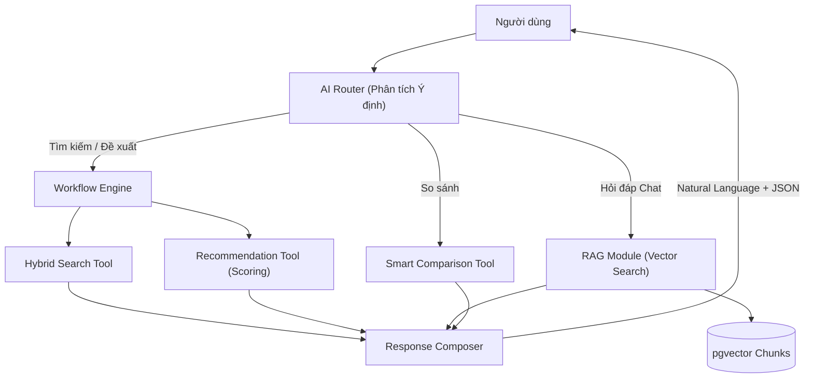
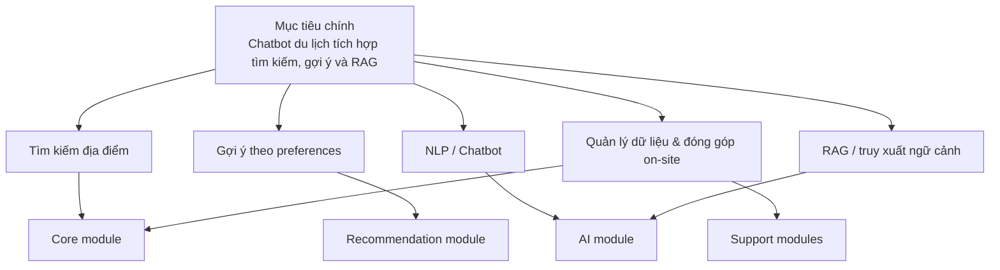
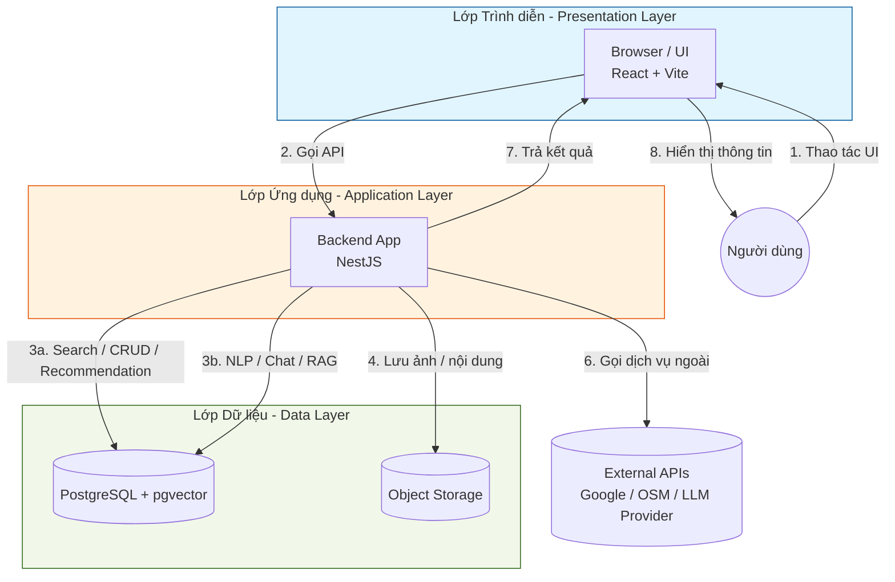
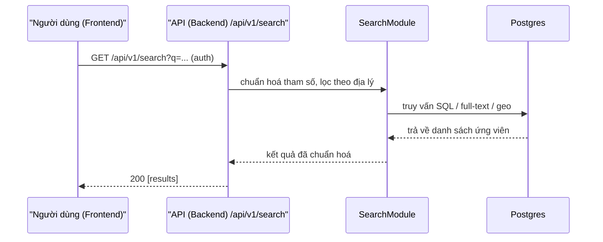
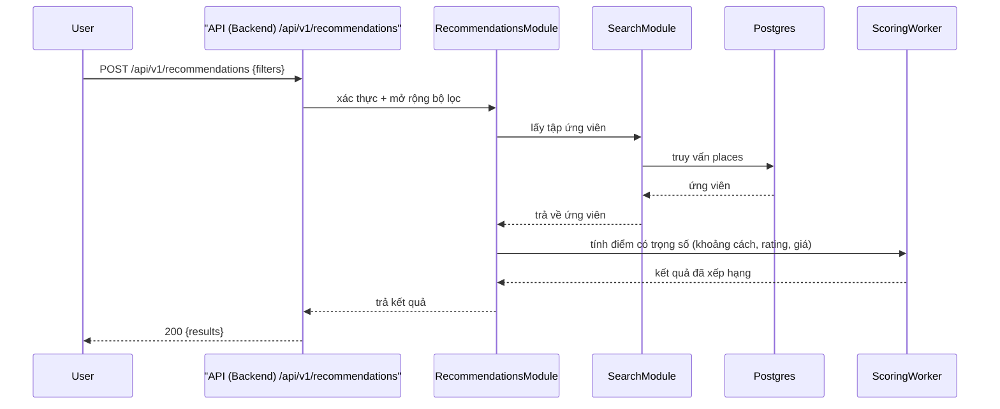
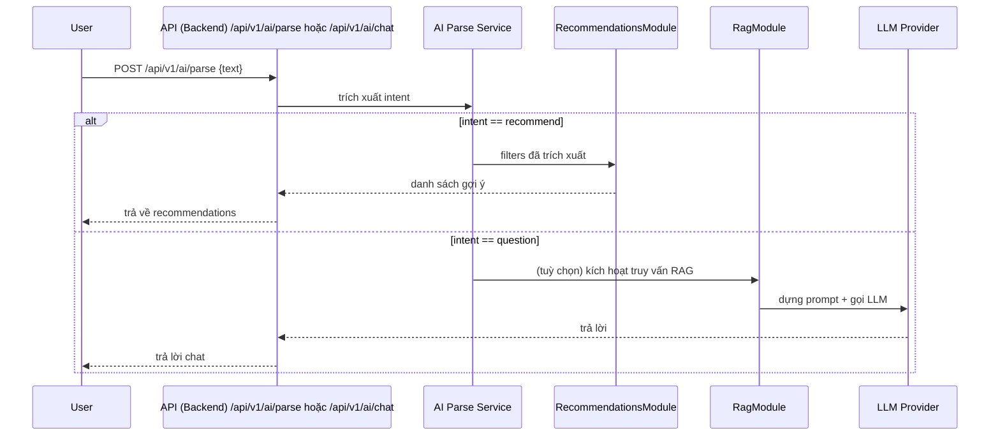
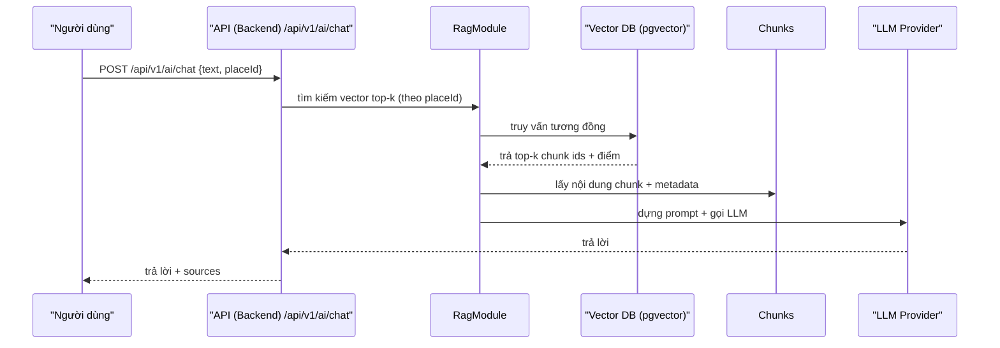
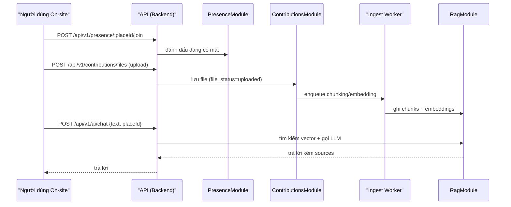

# **Báo Cáo Lần Hai** 

# **Giới thiệu**

## **Đặt vấn đề**

Hiện nay, người dùng gặp nhiều khó khăn trong việc tìm kiếm chỗ lưu trú phù hợp do thông tin bị phân tán trên nhiều nền tảng và thiếu sự đồng nhất. Các yếu tố quan trọng như giá cả, vị trí, tiện nghi và chất lượng dịch vụ thường tồn tại dưới dạng dữ liệu rời rạc, mang tính chủ quan và khó so sánh.

Điều này khiến người dùng phải tốn nhiều thời gian để tổng hợp thông tin, nhưng vẫn khó đưa ra quyết định chính xác. Đồng thời, các hệ thống hiện tại chưa thực sự hiểu nhu cầu cá nhân, chủ yếu dựa trên bộ lọc thủ công và thiếu khả năng xử lý dữ liệu đa nguồn một cách thông minh.

Do đó, nhóm chúng em đề xuất xây dựng một hệ thống gợi ý lưu trú thông minh có khả năng hiểu ngôn ngữ tự nhiên, chuẩn hoá dữ liệu từ nhiều nguồn và cung cấp các đề xuất nhanh chóng, chính xác, mang tính cá nhân hoá cao.

## **Mô tả mục tiêu chương trình**

Mục tiêu của chương trình là xây dựng một hệ thống hỗ trợ tìm kiếm và đánh giá chỗ lưu trú thông minh, giúp người dùng đưa ra quyết định nhanh chóng, chính xác và đáng tin cậy dựa trên thông tin thực tế và tương tác trực tiếp.

Để đạt được mục tiêu này, hệ thống tập trung vào các chức năng chính: cho phép người dùng tìm kiếm và xem thông tin lưu trú từ nhiều nguồn; tích hợp chatbot AI theo từng địa điểm, có khả năng hiểu ngôn ngữ tự nhiên và trả lời câu hỏi dựa trên dữ liệu như đánh giá, nội dung lưu trữ và thông tin do người dùng đóng góp; đồng thời hỗ trợ người dùng tương tác trực tiếp với những người đang có mặt tại địa điểm (on-site) thông qua cơ chế hỏi đáp và trao đổi theo thời gian thực. Bên cạnh đó, hệ thống cũng cung cấp các gợi ý lưu trú ở mức cơ bản nhằm hỗ trợ quá trình lựa chọn.

# **Problem Analysis**

## **Input**

Người dùng cung cấp yêu cầu dưới các định dạng:
1. **Ngôn ngữ tự nhiên**: Truy vấn tự do ("khách sạn rẻ gần sân bay có hồ bơi").
2. **Ngữ cảnh hiện tại (Context)**: Vị trí của người dùng, hoặc tọa độ điểm đến (Anchor Location).
3. **Bộ lọc có cấu trúc (JSON)**: Trích xuất từ AI Router hoặc nhập tay (Budget, Radius, Type, Amenities).
4. **Hành vi tương tác (On-site / Community)**:
   - Các câu hỏi / trả lời trong cộng đồng.
   - Files, hình ảnh do người dùng upload tại hiện trường (sẽ được chuyển đổi thành *Vector Embeddings*).

## **Output**

Kết quả hệ thống trả về được định dạng và cá nhân hoá cao:
1. **Danh sách địa điểm xếp hạng**: Cấu trúc JSON chứa thông tin cơ bản (lat/lng, name), điểm số (Score) được chấm dựa trên mức độ phù hợp với Input.
2. **Bảng so sánh thông minh (Smart Comparison)**: Bảng phân tích chi tiết (ưu/nhược điểm) giữa các địa điểm cùng với gợi ý cuối cùng (Recommended Place).
3. **Câu trả lời tự nhiên (AI Chat Response)**: Câu trả lời streaming qua SSE từ Chatbot, kèm theo các nguồn tham chiếu (Sources) lấy từ RAG.

## **Operators**

Quy trình chuyển hoá Input thành Output trải qua các *phép toán (Computational Operations)* cốt lõi:

**1. NLP Intent Parsing (Trích xuất ý định):** Chuyển đổi câu hỏi ngôn ngữ tự nhiên $T$ thành một vector đặc trưng hoặc cấu trúc JSON $F = \{location, budget, type\}$.
**2. Search & Deduplication (Tìm kiếm & Lọc trùng):** Quét các địa điểm từ Database và External Providers, áp dụng thuật toán hợp nhất (Merge) để loại bỏ các địa điểm trùng lặp dựa trên tọa độ và tên.
**3. Recommendation Scoring (Chấm điểm gợi ý):** Áp dụng hàm tính điểm $S(p)$ cho từng địa điểm $p$ dựa trên trọng số về khoảng cách, giá cả, và đánh giá (rating).
**4. Vector Retrieval (Truy xuất KNN):** Với câu hỏi Chatbot, chuyển câu hỏi thành embedding vector $ec{q}$, sau đó truy vấn KNN trên `pgvector` để tìm tập văn bản $ec{c_i}$ sao cho $cosine\_similarity(ec{q}, ec{c_i})$ lớn nhất.
**5. Generation & Comparison (Sinh văn bản & So sánh):** Sử dụng LLM tổng hợp các văn bản truy xuất được để đưa ra câu trả lời cuối cùng hoặc bảng phân tích so sánh điểm mạnh/yếu.


```mermaid
flowchart TD
    User["Người dùng"] --> Router["AI Router (Phân tích Ý định)"]
    
    Router -->|Tìm kiếm / Đề xuất| Engine["Workflow Engine"]
    Engine --> Search["Hybrid Search Tool"]
    Engine --> Recommend["Recommendation Tool (Scoring)"]
    
    Router -->|Hỏi đáp Chat| RAG["RAG Module (Vector Search)"]
    RAG --> DB[(pgvector Chunks)]
    
    Router -->|So sánh| Comp["Smart Comparison Tool"]
    
    Search --> Composer["Response Composer"]
    Recommend --> Composer
    RAG --> Composer
    Comp --> Composer
    
    Composer -->|Natural Language + JSON| User
```

## **Evaluation Function**

Đánh giá khả năng giải quyết bài toán qua các tiêu chí (metrics) tính toán cụ thể:

1. **Về độ chính xác (Relevance)**: 
   - $Precision@k \ge 0.75$: Đo lường tỷ lệ địa điểm phù hợp trong top $k$ kết quả trả về.
   - *Cosine Similarity* của câu trả lời RAG so với ngữ cảnh truy xuất $\ge 0.8$.
2. **Về hiệu năng (Performance)**: 
   - $Latency \le 800ms$ cho các thao tác Search/Recommend.
   - Time-to-first-token (TTFT) cho AI Chat streaming $\le 1000ms$.
3. **Chỉ số tương tác (User Engagement)**:
   - **Sentiment Score** = $rac{Positive - Negative}{Total\ Reviews}$
   - Tỷ lệ Upvote/Downvote trong Q&A cộng đồng.

## **Constraint**

1. **Ràng buộc Hệ thống (Architecture)**: 
   - Ứng dụng Monolith NestJS, không sử dụng Microservices phức tạp ở giai đoạn MVP để tiết kiệm chi phí vận hành.
   - Không sử dụng Nginx Gateway tại local dev.
2. **Ràng buộc Dữ liệu & Địa lý**:
   - Chỉ áp dụng tìm kiếm nội địa Việt Nam. 
   - Giới hạn quota gọi API LLM (Groq) và Google Maps/OSM để tránh quá tải chi phí.
3. **Ràng buộc Phần cứng (Hardware)**:
   - Chạy mượt trên máy 16GB RAM, CPU 3.8 GHz.
   - **Đặc biệt**: Không cần thiết bị có GPU/VGA cục bộ, do tác vụ LLM đã được "offload" qua API bên thứ ba.

## **Technically executable**

**1. Khả năng hiện thực hoá AI (Agentic Workflow):**
Việc sử dụng mô hình Router -> Tools -> Composer thay vì một prompt LLM khổng lồ giúp giảm ảo giác (hallucination), tăng độ chính xác 100% trong việc trích xuất JSON.

**2. Offload LLM & Tích hợp Vector DB:**
Thích hợp triển khai thực tế. Thay vì tốn kém huấn luyện mô hình (Fine-tuning) từ đầu, hệ thống tận dụng API (Groq) siêu tốc kết hợp với `pgvector` được nhúng trực tiếp trong PostgreSQL, giúp toàn bộ hệ thống (Frontend, Backend, DB) có thể khởi chạy siêu tốc chỉ qua 1 lệnh `docker-compose up`.

**3. Khả năng mở rộng (Scalability):**
Kiến trúc modular hóa các Service (SearchModule, AiModule, RagModule) cho phép dễ dàng bóc tách thành Microservices khi lượng người dùng tăng cao trong tương lai.


# **Decomposition**

## Mục tiêu và phân chia chức năng

Mục tiêu chính của dự án là giải quyết vấn đề người dùng khi tìm kiếm chỗ lưu trú bị phân mảnh và thiếu thông tin tổng hợp, giúp họ tiếp cận địa điểm phù hợp hơn và nhận được câu trả lời ngữ cảnh chính xác từ dữ liệu review và đóng góp thực tế.

Từ mục tiêu này, hệ thống được phân chia thành các chức năng nhỏ hơn:
- Tìm kiếm địa điểm
- Gợi ý phù hợp theo preferences
- Phân tích ngôn ngữ tự nhiên và trả lời hội thoại
- Truy xuất thông tin ngữ cảnh từ dữ liệu review và nội dung người dùng
- Quản lý dữ liệu người dùng, địa điểm, review và đóng góp on-site


```mermaid
graph TD
    Goal[Mục tiêu chính\nChatbot du lịch tích hợp tìm kiếm, gợi ý và RAG]

    Search[Tìm kiếm địa điểm]
    Recommend[Gợi ý theo preferences]
    NLP[NLP / Chatbot]
    RAG[RAG / truy xuất ngữ cảnh]
    Data[Quản lý dữ liệu & đóng góp on-site]

    Core[Core module]
    Rec[Recommendation module]
    AI[AI module]
    Support[Support modules]
    Goal --> Search
    Goal --> Recommend
    Goal --> NLP
    Goal --> RAG
    Goal --> Data

    Search --> Core
    Recommend --> Rec
    NLP --> AI
    RAG --> AI
    Data --> Core
    Data --> Support
```

Từ các chức năng nhỏ này, có thể đóng gói lại thành các module chuyên biệt cho các chức năng chính:
- **Core module:** quản lý dữ liệu cốt lõi và API CRUD, tương ứng với `UsersModule`, `PlacesModule`, `ReviewsModule`, `SearchModule` và `HealthModule`.
- **Recommendation module:** xây dựng hệ thống xếp hạng và gợi ý, tương ứng với `RecommendationsModule`.
- **AI module:** xử lý NLP, chatbot và RAG, tương ứng với `ChatModule`, `AiModule` và `RagModule`.
- **Support modules:** quản lý trạng thái người dùng on-site và đóng góp, tương ứng với `PresenceModule` và `ContributionsModule`.

## Tổng quan kiến trúc

Để nêu bật vị trí và vai trò của các module, cần mô tả kiến trúc tổng thể như một nền tảng kết nối, định hướng và điều phối hoạt động cho toàn bộ hệ thống.

**Kiến trúc:** sử dụng mô hình monolith có phân lớp module hoá, bao gồm 3 lớp chính:
- Frontend (React)
- Backend App (Node.js / NestJS) với các module NestJS thực tế gồm Core, AI, Recommendation, Health, Presence và Contributions
- Database: Sử dụng PostgresSQL và extension `vector` nhằm triển khai hệ thống RAG.
- Optional: reverse proxy / web server (Nginx) khi cần triển khai

**Luồng hoạt động tổng quan**

```mermaid
graph TD
    %% Định nghĩa các lớp (Subgraphs)
    subgraph PresentationLayer [Lớp Trình diễn - Presentation Layer]
        Browser[Browser / UI<br/>React + Vite]
    end

    subgraph ApplicationLayer [Lớp Ứng dụng - Application Layer]
        Backend[Backend App<br/>NestJS]
    end

    subgraph DataLayer [Lớp Dữ liệu - Data Layer]
        PG[(PostgreSQL + pgvector)]
        Obj[(Object Storage)]
    end

    External[(External APIs<br/>Google / OSM / LLM Provider)]

    User((Người dùng)) -- "1. Thao tác UI" --> Browser
    Browser -- "2. Gọi API" --> Backend
    Backend -- "3a. Search / CRUD / Recommendation" --> PG
    Backend -- "3b. NLP / Chat / RAG" --> PG
    Backend -- "4. Lưu ảnh / nội dung" --> Obj
    Backend -- "6. Gọi dịch vụ ngoài" --> External
    Backend -- "7. Trả kết quả" --> Browser
    Browser -- "8. Hiển thị thông tin" --> User

    style PresentationLayer fill:#e1f5fe,stroke:#01579b
    style ApplicationLayer fill:#fff3e0,stroke:#e65100
    style DataLayer fill:#f1f8e9,stroke:#33691e
```

## Data-flow Decomposition

Nhằm cung cấp một cái nhìn tổng quan hơn về giao tiếp giữa các module, nhóm sử dụng data-flow của chương trình để mô phỏng lại cách mà các module xử lý thông tin và trao đổi với các module khác. Trong phần này, các flow chính sẽ được minh hoạ dựa theo các Use Case đã được đề cập trong phần **Operator - Problem Analysis**.

### Use Case 1 — Tìm kiếm cơ bản
Người dùng nhập từ khoá, loại hình, vị trí hoặc ngân sách; hệ thống tìm kiếm địa điểm phù hợp trong nội bộ, chuẩn hoá kết quả và trả về cho UI.

**Endpoints**

```http
GET /api/v1/search?q=<query>&location=<location>&limit=<n>
GET /api/v1/places/:placeId
```

**Request minh hoạ:**

```http
GET /api/v1/search?q=cafe&location=Hanoi&limit=20
Authorization: Bearer <idToken>
```

**Response minh hoạ:**

```json
[
  {
    "id": "123",
    "locationId": "loc-123",
    "name": "Quán cà phê ABC",
    "address": "123 Đường X",
    "lat": 10.77,
    "lng": 106.69,
    "type": "cafe",
    "rating": 4.5,
    "imageUrl": "https://.../img.jpg",
    "priceLevel": 2,
    "source": "backend"
  }
]
```


```mermaid
sequenceDiagram
  participant U as "Người dùng (Frontend)"
  participant API as "API (Backend) /api/v1/search"
  participant Search as SearchModule
  participant DB as Postgres
  U->>API: GET /api/v1/search?q=... (auth)
  API->>Search: chuẩn hoá tham số, lọc theo địa lý
  Search->>DB: truy vấn SQL / full-text / geo
  DB-->>Search: trả về danh sách ứng viên
  Search-->>API: kết quả đã chuẩn hoá
  API-->>U: 200 [results]
```

- Các bước (ngắn gọn):
  1. Frontend gọi `GET /api/v1/search` kèm tham số và token.
  2. `Module Tìm kiếm` kiểm tra tham số, chạy truy vấn full-text/geo trên `places` (Postgres/GIN) và có thể gọi nguồn bên ngoài nếu cần.
  3. Chuẩn hoá kết quả (shape + điểm) và trả về frontend.
- Bảng CSDL: `places`, `reviews` (nếu cần join), `files` (hình ảnh).
- Fallback: nếu tìm kiếm nội bộ lỗi -> gọi API bên ngoài (OSM / Google) và chuẩn hoá kết quả.
- Chỉ số (KPIs): độ trễ tìm kiếm (p50/p95), tỉ lệ fallback, số lượng kết quả.

### Use Case 2 - Tìm kiếm nâng cao
Người dùng cung cấp bộ lọc chi tiết (vị trí, loại, ngân sách, bán kính); hệ thống thu thập candidate, tính toán điểm phù hợp và trả về kết quả đã xếp hạng.

**Endpoints**

```http
POST /api/v1/recommendations  { filters }
GET /api/v1/recommendations/:requestId
GET /api/v1/places/:placeId
```

**Request minh hoạ:**

```json
{
  "location": "10.770,106.690",
  "type": "hotel",
  "budget": "midrange",
  "radius": 5
}
```

**Response minh hoạ:**

```json
{
  "results": [
    {
      "locationId": "loc-1",
      "name": "Hotel X",
      "address": "...",
      "rating": 4.2,
      "imageUrl": "https://.../hotel-x.jpg",
      "score": 0.87,
      "type": "hotel",
      "lat": 10.77,
      "lng": 106.69
    }
  ]
}
```


```mermaid
sequenceDiagram
  participant U as User
  participant API as "API (Backend) /api/v1/recommendations"
  participant Rec as RecommendationsModule
  participant Search as SearchModule
  participant DB as Postgres
  participant Score as ScoringWorker
  U->>API: POST /api/v1/recommendations {filters}
  API->>Rec: xác thực + mở rộng bộ lọc
  Rec->>Search: lấy tập ứng viên
  Search->>DB: truy vấn places
  DB-->>Search: ứng viên
  Search-->>Rec: trả về ứng viên
  Rec->>Score: tính điểm có trọng số (khoảng cách, rating, giá)
  Score-->>Rec: kết quả đã xếp hạng
  Rec-->>API: trả kết quả
  API-->>U: 200 {results}
```

Giải thích:
  1. Backend nhận yêu cầu gợi ý, xác thực nếu cần.
  2. `Module Gợi ý` lấy tập ứng viên từ `Module Tìm kiếm` (DB + nguồn ngoài nếu cần).
  3. Pipeline tính điểm (scoring) cho từng ứng viên và xếp hạng.
  4. Trả danh sách đã xếp hạng cho frontend; lưu request để phân tích.
- Bảng CSDL: `places`, `reviews`, `contributions`, (tùy) `recommendation_requests`.
- Phương án Fallback: nếu worker tính điểm không khả dụng thì trả kết quả tìm kiếm với điểm heuristic.
- Chỉ số (KPIs): Precision@k, độ trễ xếp hạng trung bình, phân bố điểm.

### Use Case 3 — Xử lý ngôn ngữ tự nhiên
Người dùng thay vì sử dụng các tính năng tìm kiếm ở trên thì chat với chatbot, nêu rõ yêu cầu và các preferences (các preferences có thể thiếu). Chatbot được tích hợp sẽ chuẩn hoá yêu cầu của người dùng và gọi đến các module khác

**Endpoints**

```http
POST /api/v1/ai/parse    { "text": "..." }
POST /api/v1/ai/chat     { "text": "...", "conversationId": "..." }
GET  /api/v1/ai/chat/stream?conversationId=...   (SSE / streaming)
```

**Request minh hoạ:**

```json
{ "text": "Tìm chỗ ở rẻ gần sân bay", "conversationId": "opt-abc" }
```

**Response minh hoạ:**

_One-shot_

```json
{
  "answer": "Mấy lựa chọn phù hợp: ...",
  "conversationId": "abc-123",
  "finishReason": "stop",
  "messages": [
    { "role": "assistant", "content": "..." }
  ]
}
```

_Streaming SSE frames_

```
data: {"conversationId":"abc-123","delta":"Xin chào "}
data: {"conversationId":"abc-123","delta":"bạn cần gì hôm nay?"}
data: {"conversationId":"abc-123","delta":"","finishReason":"stop"}
```



```mermaid
sequenceDiagram
  participant U as User
  participant API as API (Backend) /api/v1/ai/parse hoặc /api/v1/ai/chat
  participant Parse as AI Parse Service
  participant Rec as RecommendationsModule
  participant Rag as RagModule
  participant LLM as LLM Provider
  U->>API: POST /api/v1/ai/parse {text}
  API->>Parse: trích xuất intent
  alt intent == recommend
    Parse->>Rec: filters đã trích xuất
    Rec-->>API: danh sách gợi ý
    API-->>U: trả về recommendations
  else intent == question
    Parse->>Rag: (tuỳ chọn) kích hoạt truy vấn RAG
    Rag->>LLM: dựng prompt + gọi LLM
    LLM-->>API: trả lời
    API-->>U: trả lời chat
  end
```

Giải thích các bước chính:
  1. `POST /api/v1/ai/parse` trích xuất `intent` và `extractedFilters` từ văn bản.
  2. Nếu intent là gợi ý, gọi `Module Gợi ý` và trả về kết quả cấu trúc.
  3. Nếu là câu hỏi, tùy chọn truy vấn RAG rồi gọi LLM; trả về trả lời theo luồng hoặc một lần.
  4. Lưu hội thoại và tin nhắn (số token, các chunk đã truy xuất).
- Bảng CSDL: `conversations`, `messages`, `chunks` (nếu dùng retrieval).
- Fallback: parser lỗi -> trả lỗi có cấu trúc và gợi ý dùng tìm kiếm từ khoá.
- Chỉ số (KPIs): độ chính xác parse, tỉ lệ gọi module đúng, lượng token tiêu thụ.

### Use Case 4 — Trợ lý lưu trú thông minh
Khi cần trả lời câu hỏi sâu hoặc cung cấp thông tin cho người dùng, chatbot sẽ dựa trên dữ liệu từ  reviews/contributions/QA, hệ thống lấy content liên quan từ chunk store, tạo context và dùng AI để sinh câu trả lời có nguồn thông tin rõ ràng.

**Endpoints**

```http
POST /api/v1/ai/chat
POST /api/v1/ai/rag/chunks
GET  /api/v1/chunks?placeId=...&top_k=10
```

**Response minh hoạ:**

```json
{
  "answer": "Tóm tắt: khách khen vị trí, chê dịch vụ...",
  "conversationId": "abc-123",
  "finishReason": "stop",
  "messages": [
    { "role": "assistant", "content": "..." }
  ],
  "sources": [
    { "id": "doc-1", "title": "Review by userX", "excerpt": "Những điều tốt...", "score": 0.92, "url": "/uploads/doc-1" }
  ]
}
```


```mermaid
sequenceDiagram
  participant U as "Người dùng"
  participant API as "API (Backend) /api/v1/ai/chat"
  participant Rag as RagModule
  participant Vector as "Vector DB (pgvector)"
  participant Chunks as Chunks
  participant LLM as "LLM Provider"
  U->>API: POST /api/v1/ai/chat {text, placeId}
  API->>Rag: tìm kiếm vector top-k (theo placeId)
  Rag->>Vector: truy vấn tương đồng
  Vector-->>Rag: trả top-k chunk ids + điểm
  Rag->>Chunks: lấy nội dung chunk + metadata
  Rag->>LLM: dựng prompt + gọi LLM
  LLM-->>API: trả lời
  API-->>U: trả lời + sources
```

Giải thích:
  1. Backend nhận yêu cầu chat theo `placeId` và chạy tìm kiếm vector trên `chunks.embedding` (lọc theo `place_id`).
  2. Lấy top‑k chunks, đọc nội dung/metadata và lắp ngữ cảnh.
  3. Dựng prompt (system + context + user) rồi gọi LLM (stream hoặc one‑shot).
  4. Trả lời kèm `sources` (docId, excerpt, score) và lưu `messages` gồm `retrieved_chunk_ids` và số token.
- Bảng CSDL: `chunks`, `files`, `places`, `messages`, `conversations`.
- Fallback: lỗi Vector DB -> tra cứu từ khoá trên `reviews`/`files`; LLM lỗi -> trả lời một phần hoặc canned.
- Chỉ số (KPIs): recall@k, điểm tương đồng trung bình, chất lượng trả lời (đánh giá tay), chi phí token.

### Use Case 5 — Hệ thống QA, theo dõi và tương tác với người dùng on-site

Khi người dùng vào trang chi tiết địa điểm, người dùng có thể 

**Endpoints**

```http
POST /api/v1/presence/:placeId/join
POST /api/v1/contributions/files   (file upload)
GET  /api/v1/contributions/:placeId
GET  /api/v1/files/:fileId
```

**Response minh hoạ:**

```json
{
  "placeId": "place-123",
  "presentUsers": ["userA", "userB"],
  "contributions": [
    { "fileId": "file-1", "fileName": "menu.pdf", "status": "ready" }
  ]
}
```


```mermaid
sequenceDiagram
  participant On as "Người dùng On-site"
  participant API as "API (Backend)"
  participant Presence as PresenceModule
  participant Contributions as ContributionsModule
  participant Worker as "Ingest Worker"
  participant Rag as RagModule
  On->>API: POST /api/v1/presence/:placeId/join
  API->>Presence: đánh dấu đang có mặt
  On->>API: POST /api/v1/contributions/files (upload)
  API->>Contributions: lưu file (file_status=uploaded)
  Contributions->>Worker: enqueue chunking/embedding
  Worker->>Rag: ghi chunks + embeddings
  On->>API: POST /api/v1/ai/chat {text, placeId}
  API->>Rag: tìm kiếm vector + gọi LLM
  Rag-->>API: trả lời kèm sources
  API-->>On: trả lời
```

Giải thích:
  1. Người on‑site join presence -> dùng để hiển thị Q&A live và gợi ý UX.
  2. Đóng góp (file/review) được upload và đưa vào hàng đợi chunking + embedding.
  3. Worker tạo `chunks` và lưu embedding vào vector DB; `chunks` này dùng cho RAG.
  4. Các cuộc gọi Chat/RAG sẽ truy xuất cả các đóng góp gần đây; trả lời được trả về người dùng.
- Bảng CSDL: `presence` (hoặc trạng thái presence), `files`, `chunks`, `messages`.
- Chỉ số (KPIs): thời gian từ upload đến sẵn sàng, độ chính xác presence, tỉ lệ sử dụng đóng góp trong câu trả lời RAG.

## Mô hình C4 


