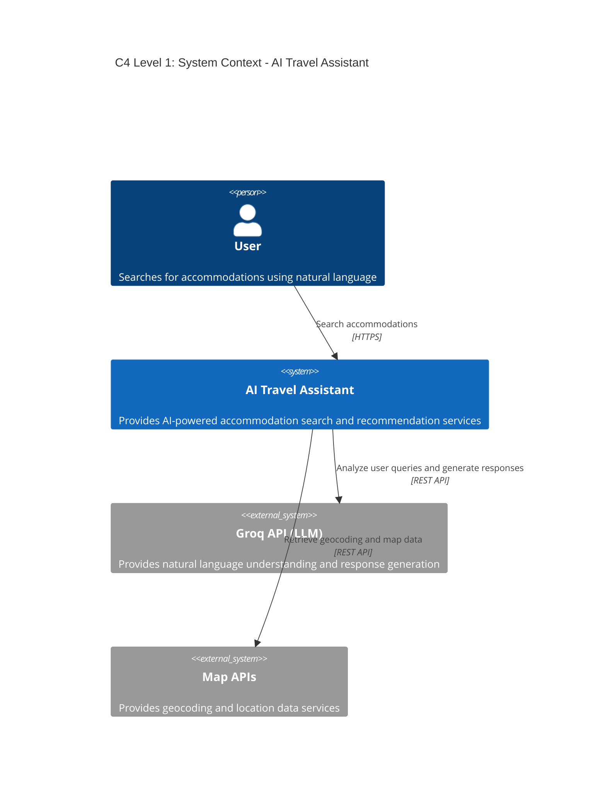
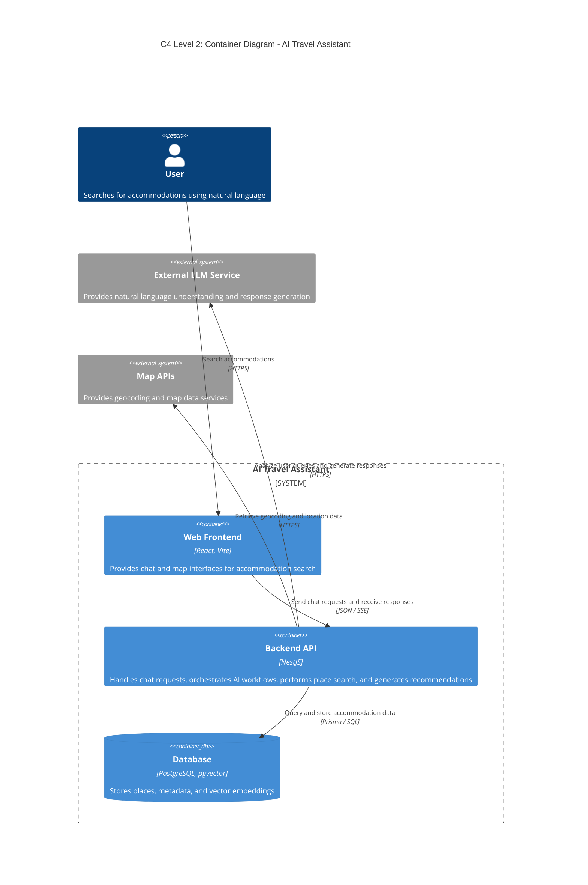
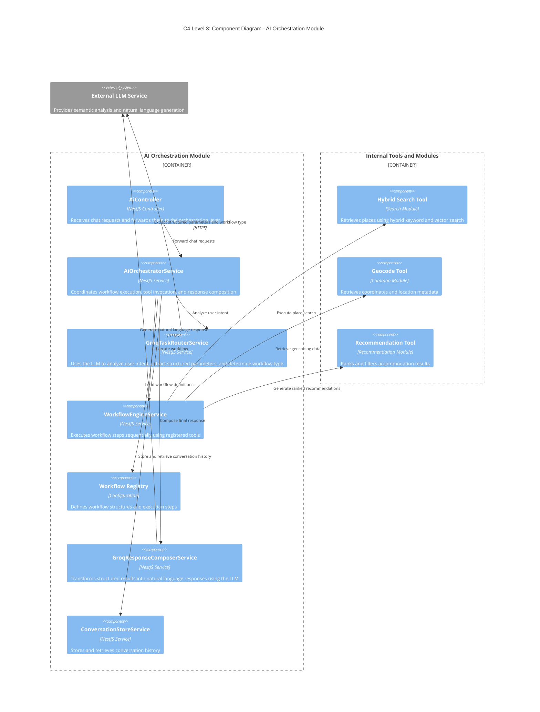
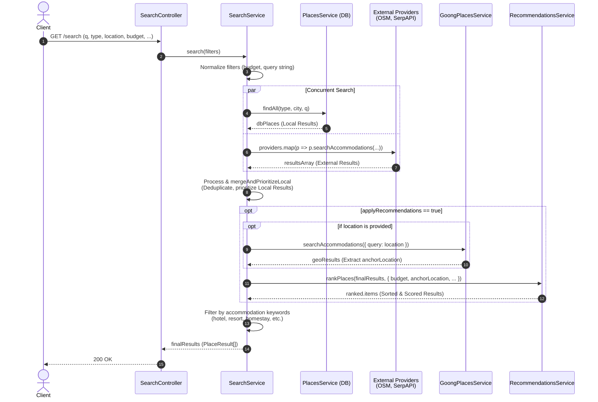

# C4 Model: AI Auto-workflow Search & Recommendations

Tài liệu này đặc tả kiến trúc cho tính năng **Auto-workflow AI Search + Recommendations**, sử dụng mô hình C4 (từ Mức 1 đến Mức 3). 

Tính năng này cho phép người dùng tìm kiếm địa điểm, nhận gợi ý và tương tác bằng ngôn ngữ tự nhiên thông qua một luồng tự động (Agentic Orchestration) bao gồm: phân tích ý định (Router), thực thi công cụ (Workflow Engine / Tools), và tổng hợp câu trả lời (Composer).

---

## 1. Mức 1: Bối cảnh hệ thống (System Context)

Mức này mô tả cách người dùng tương tác với hệ thống và các dịch vụ bên ngoài (External Systems) mà tính năng này phụ thuộc.

---

## 2. Mức 2: Khối chứa (Container Diagram)

Mức này chỉ ra các khối thực thi (Containers) bên trong hệ thống tham gia vào luồng của tính năng này.

---

## 3. Mức 3: Thành phần (Component Diagram)

Mức này phóng to vào `AI Module` để hiển thị chi tiết các thành phần (Classes/Services) cấu thành nên cơ chế Orchestration. Đây là cốt lõi của luồng Auto-workflow.

---

## 4. Luồng thực thi chi tiết (Execution Flow)

Luồng hoạt động tuân theo mô hình **Agentic Orchestration (Router - Tool Execution - Composer)**:

1. **Nhận request (Controller):** User gửi câu hỏi (VD: *"Tìm khách sạn rẻ gần sân bay Nội Bài"*).
2. **Phân tích ý định (Router):** `GroqTaskRouterService` dùng LLM để trích xuất intent thành JSON (`query="khách sạn"`, `location="Hà Nội"`, `anchor="sân bay Nội Bài"`, `budget="low"`) và quyết định chạy `WORKFLOW_REGISTRY["SEARCH_PLACES"]`.
3. **Thực thi công cụ (Engine):** `WorkflowEngineService` chạy tuần tự các công cụ (không gọi LLM ở bước này để tăng tốc độ và tính ổn định):
   - `hybrid_search`: Lấy danh sách khách sạn tại Hà Nội.
   - `geocode_anchor`: Lấy tọa độ của "sân bay Nội Bài".
   - `recommend_places`: Chấm điểm (scoring) và sắp xếp (ranking) lại danh sách khách sạn dựa trên khoảng cách tới sân bay và ngân sách.
4. **Tổng hợp phản hồi (Composer):** `GroqResponseComposerService` gom dữ liệu kết quả từ các Tools, đưa cho LLM để sinh ra câu trả lời tự nhiên cho người dùng. Frontend sẽ nhận được cả text trả lời và dữ liệu cấu trúc (JSON) để render lên giao diện (Map/Cards).

---

## 5. Sơ đồ luồng tìm kiếm tự động (Automated Search Workflow)

Sơ đồ trình tự (Sequence Diagram) dưới đây mô tả luồng thực thi chi tiết khi hệ thống thực hiện tìm kiếm tự động (Automated Search Workflow) dựa trên các tham số đầu vào. Luồng này thực hiện tìm kiếm đồng thời từ Database và các External Providers, kết hợp loại bỏ trùng lặp và áp dụng Recommendation.

